# MeshCom Firmware — Fehleranalyse Ringbuffer & Nachrichtenverlust

**Firmware-Version:** 4.35k (main branch)
**Datum:** 2026-02-22
**Author:** DK5EN / Martin S. Werner
**Betrifft:** `lora_functions.cpp`, `esp32_main.cpp`, `loop_functions.cpp`
**Referenz:** https://github.com/DK5EN/HeltecV3_MeshCom_Fork/blob/lora-improve/BUG_REPORT_RINGBUFFER_ANALYSE.md
**Bug Report:** https://github.com/icssw-org/MeshCom-Firmware/issues/708


---

## Zusammenfassung

Die aktuelle Firmware enthält mehrere zusammenwirkende Fehler im Ringbuffer- und Retransmit-System, die dazu führen, dass der Ringbuffer permanent voll ist, neue Nachrichten verloren gehen und der LoRa-Kanal mit sinnlosen Wiederholungen belastet wird. Diese Analyse dokumentiert sechs identifizierte Bugs, erklärt deren Zusammenspiel und gibt konkrete Empfehlungen zur Behebung.

---

## Inhaltsverzeichnis

1. [Übersicht: Wie der Ringbuffer funktioniert](#1-übersicht-wie-der-ringbuffer-funktioniert)
2. [BUG #1 — RX-Blindfenster durch Timeout-Race-Condition](#2-bug-1--rx-blindfenster-durch-timeout-race-condition)
3. [BUG #2 — Doppelte Interrupt-Konfiguration nach RX](#3-bug-2--doppelte-interrupt-konfiguration-nach-rx)
4. [BUG #3 — Relay-Nachrichten mit Retransmit-Flag](#4-bug-3--relay-nachrichten-mit-retransmit-flag)
5. [BUG #4 — Überhöhter CAD-Delay (cmd_counter=7)](#5-bug-4--überhöhter-cad-delay-cmd_counter7)
6. [BUG #5 — Kein Retransmit-Limit (unendliche Wiederholung)](#6-bug-5--kein-retransmit-limit-unendliche-wiederholung)
7. [BUG #6 — ACK ohne Original-Message-ID (Bytes 6-9)](#7-bug-6--ack-ohne-original-message-id-bytes-6-9)
8. [Zusammenspiel aller Bugs — Warum der Buffer überläuft](#8-zusammenspiel-aller-bugs--warum-der-buffer-überläuft)
9. [Empfehlungen](#9-empfehlungen)

---

## 1. Übersicht: Wie der Ringbuffer funktioniert

### Struktur

```
Datei: loop_functions.cpp, Zeile 248-250

unsigned char ringBuffer[MAX_RING][UDP_TX_BUF_SIZE+5] = {0};  // MAX_RING=20
int iWrite=0;   // Schreibzeiger
int iRead=0;    // Lesezeiger
```

Jeder Eintrag hat folgendes Layout:

| Byte | Bedeutung |
|------|-----------|
| `[0]` | Länge der Nachricht |
| `[1]` | **Status-Byte** (steuert Retransmit-Verhalten) |
| `[2]` | Nachrichtentyp (`0x3A`=Text, `0x41`=ACK, `0x21`=Position) |
| `[3..6]` | 4-Byte Message-ID |
| `[7+]` | Nutzdaten |

### Status-Byte Bedeutung

| Wert | Bedeutung |
|------|-----------|
| `0x00` | Wartend — bereit zum ersten Senden |
| `0x01` | Gesendet — Timer läuft |
| `0x02..0xFE` | Timer-Zähler (wird alle 2s inkrementiert) |
| `0x7F` | Retransmit-Kopie (spezielle Markierung auf main) |
| `0xFF` | **Erledigt — wird nie mehr gesendet** |

### Sende-Ablauf (ein Paket)

```mermaid
sequenceDiagram
    participant Loop as esp32loop()
    participant Gate as TX-Gate
    participant doTX as doTX()
    participant Radio as SX1262

    Loop->>Gate: iReceiveTimeOutTime==0 && !bEnableInterruptTransmit?
    Gate->>doTX: Ja → doTX() aufrufen

    Note over doTX: 1. Durchlauf: cmd_counter=7, tx_waiting=true, return false
    Note over doTX: ...7 Loop-Iterationen warten (cmd_counter--)...
    Note over doTX: 2. Durchlauf: tx_waiting=true → senden

    doTX->>Radio: radio.startTransmit(buffer, length)
    Radio-->>Loop: transmittedFlag = true (Interrupt)
    Loop->>Radio: radio.finishTransmit()
    Loop->>Radio: radio.startReceive()
    Note over Loop: iReceiveTimeOutTime = millis()
    Note over Loop: TX-Gate geschlossen für 4.5s (RECEIVE_TIMEOUT)
```

**Wichtig:** Pro Sende-Zyklus wird exakt **ein Paket** gesendet, danach folgt ein 4.5-Sekunden-Empfangsfenster.

---

## 2. BUG #1 — RX-Blindfenster durch Timeout-Race-Condition

### Betroffener Code

```
Datei: esp32_main.cpp, Zeile 1570-1610

if(iReceiveTimeOutTime > 0)
{
    if((iReceiveTimeOutTime + RECEIVE_TIMEOUT) < millis())
    {
        iReceiveTimeOutTime=0;

        // ⚠️ Kein Check ob receiveFlag gesetzt ist!
        // Wenn gerade ein Paket empfangen wurde, wird es hier überschrieben

        bEnableInterruptReceive = false;
        radio.clearPacketReceivedAction();   // ← Interrupt-Handler entfernt
        // ...
        radio.startReceive();                // ← Radio neu gestartet → Paket im Buffer verloren
    }
}
```

### Problem

Wenn ein Paket genau in dem Moment empfangen wird, in dem der `RECEIVE_TIMEOUT` (4.5s) abläuft, wird `startReceive()` aufgerufen **bevor** `receiveFlag` verarbeitet wird. Das empfangene Paket geht verloren.

```mermaid
sequenceDiagram
    participant Radio as SX1262
    participant ISR as Interrupt
    participant Loop as Main Loop

    Note over Loop: iReceiveTimeOutTime + 4500 < millis() → true
    Radio->>ISR: Paket empfangen (DIO1)
    ISR->>Loop: receiveFlag = true
    Note over Loop: ABER: Timeout-Code läuft gerade
    Loop->>Radio: startReceive() ← Paket im Buffer wird überschrieben!
    Note over Loop: receiveFlag wird erst DANACH geprüft
    Loop->>Radio: readData() → Daten sind bereits weg
```

### Auswirkung

Bei jedem Timeout-Zyklus (alle ~4.5s) gibt es ein Zeitfenster, in dem eingehende Pakete verloren gehen. Bei hohem Nachrichtenaufkommen betrifft das ca. **30-35% aller Nachrichten**.

---

## 3. BUG #2 — Doppelte Interrupt-Konfiguration nach RX

### Betroffener Code

```
Datei: esp32_main.cpp, Zeile 1622-1637 (nach checkRX)

checkRX(bRadio);    // ← ruft OnRxDone() auf, füllt den Ringbuffer

// Danach wird der Interrupt komplett neu konfiguriert:
bEnableInterruptReceive = false;
radio.clearPacketReceivedAction();     // ← Interrupt-Handler entfernt

bEnableInterruptTransmit = false;
radio.clearPacketSentAction();

bEnableInterruptReceive = true;
radio.setPacketReceivedAction(setFlagReceive);   // ← wieder gesetzt
```

### Problem

Nach `checkRX()` befinden sich die Interrupts bereits in einem konsistenten Zustand. Die anschließende Neukonfiguration erzeugt ein kurzes Zeitfenster, in dem `bEnableInterruptReceive = false` ist und eingehende Interrupts ignoriert werden.

Zusätzlich fehlt ein erneutes `startReceive()` — nach `readData()` in `checkRX()` ist der SX1262 im Standby-Modus und empfängt nichts mehr, bis der nächste Timeout-Zyklus `startReceive()` aufruft.

### Auswirkung

Nach jedem empfangenen Paket ist der Empfänger für bis zu **4.5 Sekunden blind** (bis zum nächsten `RECEIVE_TIMEOUT`).

---

## 4. BUG #3 — Relay-Nachrichten mit Retransmit-Flag

### Betroffener Code

```
Datei: lora_functions.cpp, Zeile 819-829 (OnRxDone, Relay-Pfad)

ringBuffer[iWrite][0]=size;
memcpy(ringBuffer[iWrite]+2, RcvBuffer, size);

if (ringBuffer[iWrite][2] == 0x3A)   // Text-Nachricht?
{
    if(aprsmsg.msg_payload.startsWith("{") > 0)
        ringBuffer[iWrite][1] = 0xFF;   // {CET} etc. → kein Retransmit
    else
        ringBuffer[iWrite][1] = 0x00;   // ⚠️ RETRANSMIT AKTIVIERT für Relay!
}
else
    ringBuffer[iWrite][1] = 0xFF;
```

### Problem

Wenn Knoten B eine Nachricht von Knoten A empfängt und weiterleitet (Relay/Mesh), wird diese Nachricht mit `status = 0x00` in den Ringbuffer eingetragen. Das bedeutet: **Knoten B wird die weitergeleitete Nachricht retransmittieren, wenn er kein ACK erhält**.

Aber: Das ACK des Empfängers (Knoten C) richtet sich an die Original-Message-ID von **Knoten A** — Knoten B ist nicht der Absender und wird daher **nie ein passendes ACK erhalten**.

```mermaid
graph TD
    A["Knoten A<br/>(Absender)"] -->|"Nachricht<br/>msg_id=0x1234"| B["Knoten B<br/>(Relay)"]
    B -->|"Relay<br/>msg_id=0x1234<br/>status=0x00 ⚠️"| C["Knoten C<br/>(Empfänger)"]
    C -->|"ACK<br/>ref_id=0x1234"| B

    style B fill:#ff6666,color:#000

    B -.->|"❌ ACK enthält keine msg_id<br/>→ Retransmit läuft endlos"| B
```



### Auswirkung

Jede weitergeleitete Text-Nachricht erzeugt eine **Endlos-Retransmit-Schleife** im Ringbuffer des Relay-Knotens. Bei einem Mesh-Netzwerk mit mehreren Knoten multipliziert sich dieser Effekt.

---

## 5. BUG #4 — Überhöhter CAD-Delay (cmd_counter=7)

### Betroffener Code

```
Datei: lora_functions.cpp, Zeile 1076

cmd_counter=7;    // 7 Loop-Iterationen warten vor dem Senden
```

### Problem

Vor jedem Senden wird `cmd_counter` auf 7 gesetzt. Da `doTX()` pro Aufruf `cmd_counter--` macht, dauert es **7 zusätzliche Hauptschleifen-Durchläufe** bevor ein Paket tatsächlich gesendet wird. Zusammen mit dem `RECEIVE_TIMEOUT` von 4.5s verlängert sich die Sendezeit pro Paket unnötig.

Obwohl der Kommentar im Code "CAD" (Channel Activity Detection) erwähnt, findet kein echter CAD statt — es ist ein blinder Timer.

### Auswirkung

Jedes Paket benötigt mindestens **~5s** zum Senden (4.5s RECEIVE_TIMEOUT + 7 Loop-Zyklen). Bei 20 Einträgen im vollen Buffer sind das **~100 Sekunden** Sendezeit.

---

## 6. BUG #5 — Kein Retransmit-Limit (unendliche Wiederholung)

### Betroffener Code

```
Datei: lora_functions.cpp, Zeile 1139-1195

bool updateRetransmissionStatus()
{
    for(int ircheck=0; ircheck < MAX_RING; ircheck++)
    {
        int size = ringBuffer[ircheck][0];

        if(size > 0 && ringBuffer[ircheck][1] != 0x00 && ringBuffer[ircheck][1] != 0xFF)
        {
            ringBuffer[ircheck][1]++;

            if(ringBuffer[ircheck][1] == 0x20)   // 32 × 2s = 64s Wartezeit
            {
                // Original auf 0xFF setzen (erledigt)
                ringBuffer[ircheck][1] = 0xFF;

                // ⚠️ Neuen Eintrag als Kopie anlegen — OHNE Zähler!
                memcpy(ringBuffer[iWrite], ringBuffer[ircheck], size + 2);
                ringBuffer[iWrite][1] = 0x7F;    // Retransmit-Markierung

                addRingPointer(iWrite, iRead, MAX_RING);

                return true;
            }
        }
    }
    return false;
}
```

### Problem

Es gibt **keinen Retry-Zähler**. Nach 64 Sekunden ohne ACK wird die Nachricht in einen neuen Slot kopiert, das Original wird `0xFF` gesetzt — aber die Kopie startet den Zyklus komplett neu. Da es kein `MAX_RETRANSMIT`-Limit gibt, wiederholt sich dies **endlos**.

```mermaid
graph TD
    A["Nachricht in Slot 5<br/>status=0x01"] -->|"64s ohne ACK"| B["Slot 5 → status=0xFF<br/>(erledigt)"]
    B --> C["Kopie in Slot 12<br/>status=0x7F"]
    C -->|"Gesendet"| D["Slot 12 → status=0xFF"]
    D -->|"??? Zyklus beendet?"| E["❌ NEIN — 0x7F wird sofort<br/>auf 0xFF gesetzt in doTX()"]

    style E fill:#ff9999,color:#000

    E -.->|"ABER: updateRetransmissionStatus()<br/>hat bereits eine Kopie erstellt<br/>→ endlose Ketten"| A
```



#### Genauer Ablauf einer einzelnen Nachricht:

```mermaid
sequenceDiagram
    participant Timer as updateRetransmission<br/>(alle 2s)
    participant Ring as Ringbuffer
    participant TX as doTX()

    Note over Ring: Slot 5: status=0x01, msg_id=0x1234

    loop Alle 2 Sekunden
        Timer->>Ring: ringBuffer[5][1]++ (0x01→0x02→...→0x20)
    end

    Note over Timer: status erreicht 0x20 (nach 64s)

    Timer->>Ring: Slot 5 → status=0xFF (erledigt)
    Timer->>Ring: Kopie → Slot 12, status=0x7F

    Note over TX: doTX() liest Slot 12
    TX->>Ring: Slot 12 → status=0xFF (gesendet)

    Note over Ring: ⚠️ Keine Verbindung zur Original-Nachricht<br/>Kein Zähler → nächster Zyklus startet<br/>falls status nicht 0xFF wäre

    Note over Ring: Aber 0x7F → 0xFF sofort in doTX()<br/>→ einzelner Retry, kein endloser Loop<br/>SOLANGE nur 0x7F Nachrichten betroffen sind
```



**Kritischer Punkt:** Das eigentliche Problem entsteht durch **BUG #3** — Relay-Nachrichten werden mit `status=0x00` eingetragen und durchlaufen den vollen Timer-Zyklus (0x01→0x02→...→0x20), erzeugen eine Kopie mit `0x7F`, die sofort gesendet und auf `0xFF` gesetzt wird. Aber in der Zwischenzeit (64 Sekunden!) blockiert die Nachricht einen Slot und wird nach 64s als Kopie repliziert.

### Zusammenwirken mit BUG #3 (Relay-Retransmit):

```mermaid
graph TD
    subgraph "Eingehende Relay-Nachricht"
        R1["Relay empfangen<br/>status=0x00"] --> R2["status=0x01 (gesendet)"]
        R2 --> R3["Timer: 0x01→0x02→...→0x20<br/>(64 Sekunden)"]
        R3 --> R4["Kopie erstellt, status=0x7F"]
        R4 --> R5["Gesendet → 0xFF"]
    end

    subgraph "Nächste Relay-Nachricht"
        R6["Neuer Relay empfangen<br/>status=0x00"] --> R7["Gleicher Zyklus..."]
    end

    R5 -.->|"Kein ACK → alle 64s<br/>eine Kopie pro Nachricht<br/>× Anzahl Relay-Nachrichten"| R6

    style R1 fill:#ff6666,color:#000
    style R6 fill:#ff6666,color:#000
```



### Auswirkung

In einem aktiven Mesh-Netzwerk empfängt jeder Knoten **jede weitergeleitete Text-Nachricht** mit Retransmit-Flag. Jede dieser Nachrichten belegt für 64 Sekunden einen Slot und erzeugt dann eine Kopie. Bei 5 Nachrichten pro Minute sind nach kurzer Zeit alle 20 Slots belegt.

---

## 7. BUG #6 — ACK ohne Original-Message-ID (Bytes 6-9)

### ACK-Paket-Struktur

```
ACK-Paket (12 Bytes):
Byte [0]    = 0x41 (ACK-Typ)
Byte [1-4]  = Neue ACK-Message-ID (millis())
Byte [5]    = Flags + max_hop
Byte [6-9]  = ⚠️ Original-Message-ID (SOLL den Absender identifizieren)
Byte [10]   = Node/GW-Flag
Byte [11]   = 0x00 (Ende)
```

### Betroffener Code

```
Datei: lora_functions.cpp, Zeile 610-660

// Gateway-Pfad (KORREKT):
if(bGATEWAY)
{
    if(bSendAckGateway)
    {
        print_buff[6]=aprsmsg.msg_id & 0xFF;        // ✅ Original msg_id
        print_buff[7]=(aprsmsg.msg_id >> 8) & 0xFF;  // ✅
        print_buff[8]=(aprsmsg.msg_id >> 16) & 0xFF;  // ✅
        print_buff[9]=(aprsmsg.msg_id >> 24) & 0xFF;  // ✅
        // ...
    }
}
else  // Nicht-Gateway-Pfad (FEHLERHAFT):
{
    if(strcmp(destination_call, "*") == 0 || CheckGroup(destination_call) > 0 ...)
    {
        msg_counter=millis();

        print_buff[0]=0x41;
        print_buff[1]=msg_counter & 0xFF;
        print_buff[2]=(msg_counter >> 8) & 0xFF;
        print_buff[3]=(msg_counter >> 16) & 0xFF;
        print_buff[4]=(msg_counter >> 24) & 0xFF;
        print_buff[5]=0x80 | meshcom_settings.max_hop_text;
        // ⚠️ print_buff[6..9] wird NICHT gesetzt!
        // Enthält undefinierte Werte aus dem vorherigen Buffer-Inhalt
        print_buff[10]=0x01;
        print_buff[11]=0x00;

        ringBuffer[iWrite][0]=12;
        ringBuffer[iWrite][1]=0xFF;
        memcpy(ringBuffer[iWrite]+2, print_buff, 12);
        // ...
    }
}
```

### Problem

Auf der **Sender-Seite** prüft `OnRxDone()` bei eingehendem ACK:

```
Datei: lora_functions.cpp, Zeile 129-130

unsigned msg_id = print_buff[6] | (print_buff[7] << 8) | ...;
int itxcheck = checkOwnTx(msg_id);   // ← Sucht msg_id in own_msg_id[]
```

Da `print_buff[6..9]` im Nicht-Gateway-ACK **nie die Original-Message-ID enthält**, gibt `checkOwnTx()` immer `-1` zurück → **das ACK wird nicht erkannt**.

```mermaid
sequenceDiagram
    participant A as Knoten A<br/>(Absender)
    participant B as Knoten B<br/>(Empfänger, kein GW)

    A->>B: Text-Nachricht (msg_id=0x1234ABCD)
    Note over A: ringBuffer[x][1]=0x00<br/>Wartet auf ACK

    B->>A: ACK-Paket
    Note over B: Bytes [1-4] = millis() (neue ID)<br/>Bytes [6-9] = ⚠️ UNDEFINIERT<br/>(sollte 0x1234ABCD sein)

    Note over A: checkOwnTx(undefiniert) → -1<br/>❌ ACK nicht erkannt!
    Note over A: Nachricht wird weiter retransmittiert
```



### Auswirkung

**Kein einziges ACK von einem Nicht-Gateway-Knoten wird jemals erkannt.** Das betrifft:
- Gruppennachrichten (z.B. Gruppe 9)
- Broadcast-Nachrichten (`*`)
- WLNK-1 und APRS2SOTA Nachrichten

Der Sender retransmittiert endlos (siehe BUG #5), obwohl der Empfänger die Nachricht längst erhalten hat und ein ACK gesendet hat.

---

## 8. Zusammenspiel aller Bugs — Warum der Buffer überläuft

### Szenario: 3 Knoten, Gruppennachricht

```mermaid
sequenceDiagram
    participant A as Knoten A<br/>(sendet an Gruppe 9)
    participant B as Knoten B<br/>(Relay + Empfänger)
    participant C as Knoten C<br/>(Empfänger)

    Note over A: Nachricht erstellt<br/>ringBuffer: status=0x00

    A->>B: "Hallo Gruppe 9" (msg_id=0x1234)
    A->>C: "Hallo Gruppe 9" (msg_id=0x1234)

    Note over B: BUG #3: Relay mit status=0x00 ⚠️
    B->>C: Relay: "Hallo Gruppe 9" (msg_id=0x1234)

    Note over B: BUG #6: ACK ohne msg_id
    B->>A: ACK (Bytes 6-9 = undefiniert) ⚠️
    C->>A: ACK (Bytes 6-9 = undefiniert) ⚠️

    Note over A: BUG #6: ACK nicht erkannt → weiter retransmittieren
    Note over B: BUG #3+#5: Relay-Kopie retransmittiert endlos

    loop Alle 64 Sekunden
        Note over A: BUG #5: Kopie erstellt → neuer Slot belegt
        Note over B: BUG #5: Relay-Kopie erstellt → neuer Slot belegt
    end

    Note over A,C: Buffer auf A und B füllt sich stetig mit Retransmit-Kopien
```



### Buffer-Auslastung über Zeit

```mermaid
graph LR
    subgraph "t=0s"
        S0["Slot 0: Nachricht 1 (0x00)<br/>Slot 1-19: leer"]
    end
    subgraph "t=5s (nach Relay)"
        S1["Slot 0: Nachricht 1 (0x01)<br/>Slot 1: ACK (0xFF) ✓<br/>Slot 2: Relay-A (0x00) ⚠️<br/>Slot 3: ACK (0xFF) ✓<br/>Slot 4-19: leer"]
    end
    subgraph "t=64s"
        S2["Slot 0: Nachricht 1 (0xFF)<br/>Slot 1: ACK (0xFF)<br/>Slot 2: Relay-A (0xFF)<br/>...<br/>Slot 8: KOPIE Nachricht 1 (0x7F)<br/>Slot 9: KOPIE Relay-A (0x7F)<br/>Slot 10-19: leer"]
    end
    subgraph "t=180s (3 Min.)"
        S3["⚠️ ALLE 20 SLOTS BELEGT<br/>mit Retransmit-Kopien<br/>und neuen Nachrichten<br/><br/>→ RING_OVERFLOW<br/>→ Neue Nachrichten<br/>   überschreiben alte"]
    end

    S0 --> S1 --> S2 --> S3
```



### Endergebnis

```mermaid
flowchart TD
    BUG3["BUG #3<br/>Relay mit status=0x00"] --> FILL["Ringbuffer füllt sich<br/>mit Retransmit-Einträgen"]
    BUG6["BUG #6<br/>ACK ohne msg_id"] --> NOACK["ACK wird nie erkannt"]
    NOACK --> FILL
    BUG5["BUG #5<br/>Kein Retransmit-Limit"] --> FILL
    FILL --> FULL["Buffer permanent voll<br/>(20/20 Slots)"]
    FULL --> OVERFLOW["addRingPointer() → OVERFLOW<br/>iRead wird vorgerückt"]
    OVERFLOW --> LOST["Neue Nachrichten werden<br/>überschrieben bevor sie<br/>gesendet werden können"]
    BUG1["BUG #1<br/>RX-Blindfenster"] --> MISS["~30% der eingehenden<br/>Pakete gehen verloren"]
    BUG2["BUG #2<br/>Kein startReceive nach RX"] --> MISS
    BUG4["BUG #4<br/>cmd_counter=7"] --> SLOW["Sendezeit pro Paket ~5s<br/>Buffer-Drain dauert >100s"]
    SLOW --> FULL
    MISS --> NOACK

    style FULL fill:#ff4444,color:#fff
    style LOST fill:#ff4444,color:#fff
    style MISS fill:#ff9944,color:#000
```



---

## 9. Empfehlungen

### BUG #1 — RX-Blindfenster

**Datei:** `esp32_main.cpp`, Zeile ~1573

**Empfehlung:** Vor dem `startReceive()` im Timeout-Handler prüfen, ob `receiveFlag` gesetzt ist. Falls ja, Timer nur zurücksetzen und das Paket im nächsten Zyklus verarbeiten lassen:

```cpp
if((iReceiveTimeOutTime + RECEIVE_TIMEOUT) < millis())
{
    if(receiveFlag)
    {
        // Paket wartet auf Verarbeitung — nicht überschreiben
        iReceiveTimeOutTime = millis();
    }
    else
    {
        iReceiveTimeOutTime = 0;
        // ... startReceive() wie bisher ...
    }
}
```

### BUG #2 — Doppelte Interrupt-Konfiguration

**Datei:** `esp32_main.cpp`, Zeile ~1622-1637

**Empfehlung:** Nach `checkRX()` ein `startReceive()` aufrufen und die redundante Interrupt-Neukonfiguration entfernen. `checkRX()` ruft `readData()` auf, danach ist der SX1262 im Standby:

```cpp
checkRX(bRadio);

// Direkt wieder empfangsbereit machen
int state = radio.startReceive();
iReceiveTimeOutTime = millis();
```

### BUG #3 — Relay-Nachrichten

**Datei:** `lora_functions.cpp`, Zeile ~821-826

**Empfehlung:** Relay-Nachrichten grundsätzlich als Fire-and-Forget markieren. Nur der **ursprüngliche Absender** sollte retransmittieren:

```cpp
// Relay-Nachrichten: immer 0xFF (kein Retransmit)
ringBuffer[iWrite][1] = 0xFF;
```

### BUG #4 — CAD-Delay

**Datei:** `lora_functions.cpp`, Zeile ~1076

**Empfehlung:** `cmd_counter` von 7 auf 3 reduzieren, oder echtes CAD (Channel Activity Detection) des SX1262 nutzen:

```cpp
cmd_counter = 3;    // Reduzierter blinder Delay
```

### BUG #5 — Retransmit-Limit

**Datei:** `lora_functions.cpp`, `updateRetransmissionStatus()`

**Empfehlung:** Einen Retry-Zähler pro Slot einführen und nach N Versuchen aufgeben:

```cpp
uint8_t retryCount[MAX_RING] = {0};   // Neues Array
#define MAX_RETRANSMIT 3               // Maximal 3 Versuche

// In updateRetransmissionStatus(), beim Kopieren:
if(retryCount[ircheck] >= MAX_RETRANSMIT)
{
    ringBuffer[ircheck][1] = 0xFF;   // Aufgeben
    continue;
}
retryCount[iWrite] = retryCount[ircheck] + 1;
```

### BUG #6 — ACK-Message-ID

**Datei:** `lora_functions.cpp`, Zeile ~648-656

**Empfehlung:** Im Nicht-Gateway-ACK-Pfad die Original-Message-ID in Bytes 6-9 einfügen (identisch zum Gateway-Pfad):

```cpp
print_buff[6] = aprsmsg.msg_id & 0xFF;
print_buff[7] = (aprsmsg.msg_id >> 8) & 0xFF;
print_buff[8] = (aprsmsg.msg_id >> 16) & 0xFF;
print_buff[9] = (aprsmsg.msg_id >> 24) & 0xFF;
```

---

### Priorität der Behebung

| Priorität | Bug | Auswirkung | Aufwand |
|-----------|-----|------------|---------|
| 🔴 Kritisch | BUG #3 | Relay-Retransmit flutet den Buffer | 1 Zeile |
| 🔴 Kritisch | BUG #6 | ACKs werden nie erkannt | 4 Zeilen |
| 🔴 Kritisch | BUG #5 | Endlose Retransmits ohne Limit | ~15 Zeilen |
| 🟡 Hoch | BUG #1 | ~30% Paketverlust durch RX-Race | 5 Zeilen |
| 🟡 Hoch | BUG #2 | RX-Blindheit nach Paketempfang | 3 Zeilen |
| 🟢 Mittel | BUG #4 | Unnötig langer Sende-Delay | 1 Zeile |

**Die Kombination von BUG #3, #5 und #6 ist die Hauptursache für den permanenten Buffer-Overflow und den damit verbundenen Nachrichtenverlust.**
